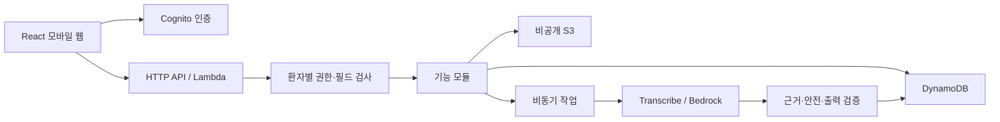

# 바통 아키텍처

현재 상태는 설정·디렉터리 뼈대이며 기능과 AWS 자원은 없다.

- web: 화면·접근성·허용 응답 표시. 인증 상태를 관리하되 권한 보장은 서버에서 수행.
- api: 환자·구성원·작업·원문 접근 검사와 기능 모듈·비동기·AI 파이프라인.
- contracts: API DTO와 런타임 스키마만 공유. DB·AWS·비밀 설정 제외.
- infra: 프론트 Hosting과 SAM 자원 설계; 현재 미배포.
- fixtures: 일관된 가상 자료와 정답; 공개 웹 assets와 분리.

AI 출력 검증 → 요약 저장·공유 상태 반영 → 현행 권한으로 조회한다.
환자·진료과 선택과 비공개 메모 제외는 AI 호출 전 적용한다.
출력 공개 시에도 scope별 허용 필드·인용을 검사해 요약을 통한 정보 누출을 막는다.

설계 상세: [구현 계획](../specs/001-baton-mvp/plan.md),
[데이터 모델](../specs/001-baton-mvp/data-model.md),
[API 계약](../specs/001-baton-mvp/contracts/api.md).
