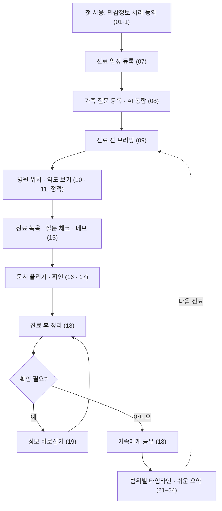
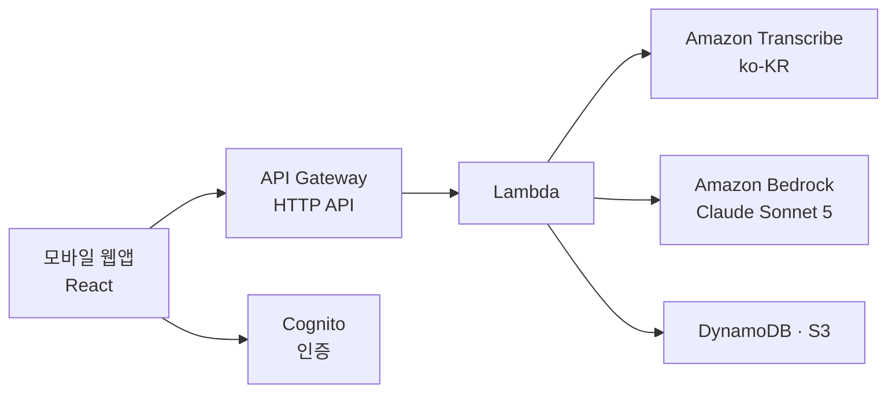

# 바통(Baton) 기획 문서 — 스펙 작성용

> **기준** 2026-10-09 · UI 와이어프레임 v6 · 노션 'AWS DevDay'(프로젝트 가이드 · 기능 따라가기 · 공개 범위)
> **용도** spec.md 작성의 입력입니다. 결정된 내용을 기준으로 적었고, 아직 정하지 않은 것은 [12. 스펙 작성 전 정할 것](#12-스펙-작성-전-정할-것)에 모았습니다.
> **표기** 표시 없음 = 확정 · `[제안]` 합의 전 · `[미정]` 논의 중 · `[확인 필요]` 사실 여부 미검증(공식 문서 · 운영진 확인 후 확정)
> **개정 2026-10-09** AI 결과를 열람 등급별 블록으로 나눠 저장하고 서버는 허용 블록만 응답하는 구조 반영(3 · 8 · 9장, 부록 A · B) / 배포하지 않는 것을 반영하고 AWS 사용 여부는 `[미정]`으로 정리(10 · 12장) / 단계 충돌 · 누락 수정(5 · 7 · 12장)

---

## 1. 개요

| 항목 | 내용 |
|---|---|
| 서비스명 | 바통(Baton) — 진료 동행 노트 |
| 한 줄 정의 | 진료의 바통을 가족끼리 이어 준다 |
| 핵심 가치 | 가족이 번갈아 동행해도 진료 맥락이 끊기지 않는 '진료 인수인계' |
| 대상 | 보호자 동행이 필요한 환자 전반(고령자 · 어린이 · 장애인 등). 용어는 '환자 · 보호자' |
| 형태 | React 기반 모바일 우선 웹앱 |
| 구현 제약 | 해커톤 당일 약 5시간 · 4명. 구현은 당일에만. 배포는 하지 않고 로컬에서 시연 |

**문제** 진료 시간은 짧고, 동행하는 가족이 바뀔 때마다 지난 진료의 맥락(증상, 복약 변경, 다음 일정)이 끊깁니다.

**해결** 진료 전 · 중 · 후를 하나의 기록으로 이어서, 누가 동행하든 직전까지의 맥락을 이어받게 합니다.

---

## 2. 사용자와 역할

모든 사용자는 자기 계정으로 로그인합니다. 한 계정이 '내 기록'과 '연결된 환자의 기록'을 함께 가집니다(보호자도 환자가 될 수 있음).

| 역할 | 권한 |
|---|---|
| **환자** (기록 주인) | 자기 기록 전체 열람, 보호자별 공개 범위 변경, 대표 보호자 위임 설정, 진료 녹음 허용, 비공개 메모(본인만) |
| **대표 보호자** | 전체 내용 열람. 위임이 켜져 있을 때만 공개 범위 변경 대행. 비공개 메모는 볼 수 없음 |
| **보호자** | 부여받은 공개 범위만큼 열람, 가족 질문 등록, 동행 시 기록. 다른 가족의 범위는 볼 수 없음 |

- 설정은 환자 직접이 기본, 어려우면 대표 보호자가 대행합니다.
- 데모는 시드 계정(환자 · 대표 보호자 · 보호자)으로 진행합니다. 가입은 화면만 있습니다.
- 동행자 · 베이비시터 · 제3자(요양보호사 등) 역할은 이번 범위 밖입니다.

---

## 3. 설계 원칙

1. **이어받기** — 누가 동행하든 진료 직전 브리핑으로 지난 맥락을 이어받는다. 데모 핵심 장면.
2. **같은 진료과끼리만 잇는다** — 진료과 태그로 분류하고, AI 입력에도 같은 과 기록만 넣는다. 합의 전(`[제안]`)이지만 와이어프레임 · 기능 정리에는 이미 반영되어 있다.
3. **AI는 정리만** — 진단 · 처방 · 검사 수치를 해석하지 않는다. 두 기록이 다르면 다르다는 것만 알리고 어느 쪽이 맞는지 판단하지 않는다.
4. **근거가 없으면 비운다** — 모든 AI 출력 항목에 원문 위치를 달고, 근거가 없으면 값을 비운 채 '확인 필요'로 표시한다.
5. **원문으로 돌아갈 수 있게** — 요약 · 비교 항목마다 '원문 보기'를 둔다. 단 원문(녹음 · 문서 · 인용)은 전체 내용 범위에서만 열린다(8.2). `[제안]`
6. **범위를 드러내지 않는다** — 보호자별 공개 범위는 다른 보호자에게 보이지 않는다. 범위 밖 항목은 '숨김' 표시 없이 처음부터 없는 것처럼 보여준다.
7. **권한은 서버에서 거른다** — 화면에서 숨기지 않는다. AI 결과는 만들 때 열람 등급별 블록으로 나눠 저장하고, 서버는 열람자 범위에 허용된 블록만 읽어 응답한다(8.2 · 8.3). 읽을 때 AI를 다시 부르지 않는다. `[제안]`
8. **지도 · 약도는 정적으로** — 보여주기만 하고 길찾기 · 가는 법 안내 · 동선 계산은 하지 않는다.
9. **누구나 읽을 수 있게** — 환자 화면은 쉬운 말로, 모든 화면은 글씨 크기 · 고대비를 바꿀 수 있게 한다.
10. **녹음은 숨기지 않는다** — 녹음 중일 때는 화면에서 분명하게 드러낸다.

---

## 4. 사용 흐름



| 단계 | 사용자 행동 | 화면 |
|---|---|---|
| 시작 | 로그인, 첫 사용 시 민감정보 동의, 가족 연결(범위 고지 · 동의) | 01 · 01-1 · 06 |
| 진료 전 | 일정 등록, 가족 질문, AI 통합, 브리핑, 병원 위치 · 약도. 환자는 비공개 메모 · 진료실 화면 준비 | 07–13 |
| 진료 중 | 녹음(녹음 중 표시), 질문 체크, 메모, 처방전 · 약봉투 사진 | 15 · 16 |
| 진료 후 | AI 정리 → 확인 필요 처리 → 가족 공유, 방문 경험 | 17–20 |
| 기록 보기 | 진료과별 타임라인(범위별로 다르게 보임), 흐름, 쉬운 요약 | 21–24 |
| 설정 | 글씨 크기 · 고대비, 공개 범위 관리, 위임 · 녹음 허용 · 알림 | 25 · 25-1 · 25-2 |

### 데모 시나리오 `[제안]`

1. 보호자 A가 지난 진료에 동행해 기록이 쌓여 있습니다(시드).
2. 이번에는 보호자 B가 동행합니다. B가 자기 계정으로 로그인합니다.
3. 진료 직전 브리핑에서 '지난 진료 이후 바뀐 점'과 질문 리스트를 확인합니다.
4. 진료 중 녹음하고 질문을 체크합니다.
5. 진료 후 정리 기록이 공유되고, 처방 변경이 이전과 비교되어 보입니다.

B의 열람 범위에 따라 브리핑에 보이는 항목이 달라집니다(8.2, 12.2 · 12.13).

### 시드 데이터

- 환자 1명. 내과 1 · 2월 진료 기록과 3월 예정 진료, 정형외과 2월 기록
- 확인 필요 1건: 가족 메모 '저녁 혈압약 반 알로 줄임' vs 약봉투 '아침 약 용량 변경'
- 가족 질문 3개 → AI가 2개로 통합 + 기록에서 더한 확인 질문 1개
- 가상 병원 1곳의 위치 · 원내 약도 이미지 · 안내 순서
- 같은 병원 · 내과의 더미 방문 경험 메모 몇 개 `[제안]`
- 시연용 가상 음성 파일과 미리 변환한 전사본, 미리 생성한 브리핑 · 정리 결과(등급별 블록으로 저장, 8.2). `full` 블록에는 진단명 · 검사 수치 자리표시자(`[진단명]` · `[검사 수치]`)를 넣어 두어야 동행과 전체 내용의 차이가 보임
- 가족 관찰 메모 시드 `[제안]`: 확인 필요 1건의 '가족 메모'와 브리핑의 '가족 관찰'이 읽는 값. 1단계는 등록 화면 없이 시드로 고정(12.2)

---

## 5. 구현 범위

| 구분 | 내용 |
|---|---|
| **1단계** — 당일 우선 | 시드 계정 로그인 · 가족 질문 통합 · 진료 전 브리핑 · 진료 기록 정리 · 진료과별 타임라인 · 처방 비교 · 공개 범위(3단계 · 등급별 블록 응답) · 글씨 크기 · 고대비 |
| **2단계** — 1단계 이후 | 사진 · 음성 입력(앱 녹음 · 촬영) · 비공개 메모 · 위임 · 방문 경험 |
| **정적** — 동적 기능 없이 보여주기만 | 병원 위치 지도(카카오 또는 네이버 지도 API, 위치 표시만) · 원내 약도(정적 이미지) |
| **화면만** — 와이어프레임으로 제시 | 회원가입 · 가족 초대 실제 동작(관계는 시드) · 진료 일정 등록 · 푸시 알림 · 언어 · 해외 진료 번역(후순위) · 병원 시스템 연동 |
| **만들지 않음** | 녹음 동의 확인 화면 · 원내 동선 계산 · 길찾기 · 가는 법 안내 · 돋보기 · 배포 |

### 시연 우선순위 `[제안]`

4명 · 5시간에 1단계가 모두 끝나지 않을 때 먼저 살릴 두 경로입니다. 나머지는 시드 값으로 고정합니다.

1. **이어받기 경로** — B 로그인 → 진료 전 브리핑(09) → 음성 파일 변환(15) → 진료 후 정리(18) → 처방 비교 · 확인 필요(19)
2. **범위 경로** — 환자 계정으로 B의 범위 변경(25-2) → B 화면이 23 · 23-1처럼 바뀜, B가 범위 변경 API를 부르면 403

---

## 6. 기능 목록

| ID | 기능 | 설명 | 화면 | 단계 |
|---|---|---|---|---|
| F01 | 로그인 | 이메일 · 비밀번호. 가입 · 비밀번호 찾기는 화면만 | 01 | 1단계 |
| F02 | 민감정보 처리 동의 | 첫 사용 시 민감정보 별도 동의, 고지 항목 표시, 만 14세 미만은 법정대리인 동의 경로 | 01-1 | `[제안]` 화면만 |
| F03 | 기록 주인 선택 | '누구의 진료 기록을 볼까요?' 칩(나 / 연결된 환자) | 02 · 03 | 1단계 (03은 빈 화면만) |
| F04 | 홈 요약 | 다음 진료, 확인 필요 수, 가족 질문 수, 진료과별 최근 기록. 범위에 따라 섹션이 달라짐 | 02 · 04 | 1단계 |
| F05 | 환자 홈 | 큰 글씨, 오늘 먹을 약, 쉬운 요약 · 의사에게 보여주기 · 비공개 메모 바로가기 | 05 | `[제안]` 화면만 |
| F06 | 가족 연결 | 초대 코드 생성 · 입력, 처음 공유할 범위(3단계) 선택, 공유 항목 고지와 동의 | 06 | 화면만 (관계는 시드) |
| F07 | 진료 일정 등록 | 진료과 · 병원 · 날짜 · 시간 · 태그 | 07 | `[제안]` 화면만 |
| F08 | 가족 질문 통합 | 가족이 각자 질문 → AI가 비슷한 질문을 합치고 기록 기반 확인 질문 추가 | 08 | 1단계 |
| F09 | 진료 전 브리핑 | 같은 진료과 지난 기록 기반: 바뀐 점 · 지켜볼 증상 · 먼저 받을 검사 · 준비사항 · 질문 | 09 | 1단계 (동선 미리보기는 정적) |
| F10 | 병원 위치 | 지도 API로 위치 표시, 주소 · 전화 | 10 | 정적 |
| F11 | 원내 약도 | 약도 이미지, 안내 순서, 다른 이용자 경험 메모(더미) | 11 | 정적 |
| F12 | 비공개 메모 | 환자 본인만 보는 메모, 의사용 화면 포함 여부 토글 | 12 | 2단계 |
| F13 | 진료실에서 보여주기 | 의사에게 보여줄 큰 글씨 정리 화면 | 13 | `[제안]` 2단계 |
| F14 | 진료 녹음 · 음성 인식 | 1단계: 준비한 음성 파일 업로드 → 텍스트 변환, 메모 / 2단계: 앱 직접 녹음, 질문 체크 저장 / 녹음 중 표시 / 실시간 자막 `[제안]` 추가 과제 | 15 | 1단계 + 2단계 |
| F15 | 문서 올리기 | 처방전 · 진단서 · 검사 안내문 · 약봉투 · 병원 약도, 언제든 업로드 | 16 | 2단계 |
| F16 | 문서 판독 · 확인 | AI가 사진에서 항목 추출, 근거 · 확인 필요 · 직접 고치기, 진료 연결 추천 | 17 | 2단계 |
| F17 | 진료 후 정리 · 공유 | 전사 · 메모 · 문서로 약 변경 · 주요 설명 · 다음 일정 · 질문 답변을 정리해 등급별 블록(일정 · 동행 · 전체 내용)으로 저장, 가족 공유 | 18 | 1단계 |
| F18 | 처방 비교 · 불일치 탐지 | 이전 처방과의 차이 표시, 가족 메모와 약봉투 비교 | 09 · 18 · 19 · 21 | 1단계 (약봉투 값은 시드) |
| F19 | 방문 경험 | 다닌 순서 · 대기시간 · 한 줄 팁을 익명으로 남김 | 20 | 2단계 |
| F20 | 진료과별 타임라인 | 진료과 필터, 공개 범위에 따른 블록 필터 | 21 · 23 · 23-1 | 1단계 |
| F21 | 타임라인 흐름 | 같은 약 · 증상 기록을 '결정 → 관찰 → 확인 예정'으로 묶기 | 22 | `[제안]` 2단계 |
| F22 | 쉬운 진료 요약 | 환자 · 동행 범위용 쉬운 말 요약. 18번 정리 호출이 `easySummary`를 함께 만들어 저장(1단계, 23-1에 필요)하고, 24번 화면은 저장된 값을 표시 | 24 | 생성 1단계 · 화면 `[제안]` 2단계 |
| F23 | 공개 범위 관리 | 보호자별 3단계 범위 변경, 범위별 항목표, 허용 블록만 응답하는 서버 필터 | 25 · 25-2 | 1단계 |
| F24 | 공유 기록 · 공유 멈추기 | 범위 변경 · 공유 시작 기록 표시, 보호자별 공유 중단 | 25-2 | `[제안]` 기록 1단계 · 멈추기 2단계 |
| F25 | 글씨 크기 · 고대비 | 설정에서 바꾸면 모든 화면에 적용 | 25 · 25-1 | 1단계 |
| F26 | 기타 설정 | 로그아웃(1단계) · 위임 · 녹음 허용(2단계) · 알림 · 경험 공유 · 언어(화면만) | 25 | 혼합 |
| F27 | 해외 진료 · 번역 | 언어 설정, 해외 진료 기록, 현지 의사용 번역 요약 | 26–29 | 화면만 · 후순위 |

---

## 7. 화면 명세 (와이어프레임 v6)

모바일 390px 기준, 하단 탭(홈 · 타임라인 · 설정). 예시 데이터는 `[대괄호]` 자리표시자입니다.

### ① 시작 · 홈

**01 로그인** — 1단계
- 이메일 · 비밀번호, 로그인. '비밀번호 찾기' · '가입하기'는 화면만
- 완료 기준: 세 계정으로 로그인하면 홈에 다른 내용이 보임

**01-1 민감정보 처리 동의 (첫 사용)** — `[제안]` 화면만
- 처리하는 민감정보(진료 기록 · 처방 · 녹음 · 문서), 이용 목적, 보유 기간(자리표시자), 거부할 권리
- 필수 동의 2개: 건강 정보(민감정보) 처리 별도 동의, 개인정보 수집 · 이용 동의. 각각 '전문 보기'
- "가족에게 보여줄 항목은 가족 연결 때 따로 동의" 안내
- 만 14세 미만: 법정대리인 동의 경로
- 동의 내용과 날짜를 기록으로 남김

**02 홈 · 가족 기록** — 1단계
- 기록 주인 칩(나 · 환자 · + 가족 연결), 진료과 필터
- 다음 진료 카드: 진료과, 일시 · 병원, 이번 동행자, '진료 전 브리핑 보기', '병원 약도 · 동선 보기'(10 · 11로)
- 확인 필요 카드, 가족 질문 카드("3개 → AI가 2개로 정리"), 문서 올리기 · 해외 진료용 요약 바로가기, 진료과별 지난 기록
- 완료 기준: 대표 보호자로 로그인하면 시드 기록이 진료과별로 보이고 확인 필요 1건이 뜸

**03 홈 · 내 기록** — 1단계 (빈 화면만)
- 빈 상태 + 일정 등록 · 문서 올리기 · 가족 초대 버튼(화면만)

**04 홈 · 일정만 공유받은 경우** — 1단계
- 02와 같은 컴포넌트. 다음 진료 카드(브리핑 버튼 없음)와 예정 일정만. 잠금 · '권한 없음' 표시 없음
- 완료 기준: 해당 보호자의 API 응답에 `companion` · `full` 블록 키가 없음(약 · 설명 필드 없음)

**05 환자 홈** — `[제안]` 화면만
- 큰 글씨, 다음 진료, 오늘 먹을 약(아침 · 저녁 체크), 쉬운 요약 · 의사에게 보여주기 · 비공개 메모 바로가기

**06 가족 연결** — 화면만 (관계는 시드)
- 초대 코드로 연결하기(입력)
- 내 기록에 가족 초대하기: 처음 공유할 범위(일정만 · 동행 · 전체 내용) → 이 가족이 보게 될 항목 목록(민감 정보 항목은 '민감 정보' 표시) → 고지(받는 사람 · 이용 목적 · 공유 기간 · 거부할 권리) → 공유 동의 체크 → 초대 코드 만들기(1회용) · 복사
- 가족에게는 범위 이름이 보이지 않음

**07 진료 일정 등록** — `[제안]` 화면만
- 진료과(내과 · 정형외과 · 소아청소년과 · 피부과 · 이비인후과 · 안과 · 직접 입력), '예약 문자 · 안내문 사진으로 채우기', 병원, 날짜, 시간, 태그

### ② 진료 전

**08 가족 질문 등록** — 1단계
- 질문 추가, 등록된 질문(작성자 표시), AI 정리(합친 원 질문 번호, 'AI 추가' 질문과 근거 기록. 근거 기록은 전체 내용 범위에서만 보임 `[제안]`), '이 질문으로 브리핑 만들기'
- 완료 기준: 비슷한 질문 2개가 하나로 묶이고 원 질문을 따라갈 수 있음

**09 진료 전 브리핑** — 1단계 · 데모 핵심
- 바뀐 점(약 · 용량 변경 · 이유 · 원문 보기), 지켜볼 증상(가족 관찰 · 지난 진료에서 지켜보기로 한 것), 먼저 받을 검사 · 준비사항(근거 없으면 '확인 필요'), 병원 동선 미리보기(정적 이미지), 오늘 물어볼 질문, '진료 시작 · 녹음'
- 열람 범위별 표시 `[제안]`: 전체 내용은 위 항목 전부와 원문 보기. 동행은 바뀐 점(이유 · 원문 보기 제외)과 오늘 물어볼 질문만. 지켜볼 증상 · 먼저 받을 검사 · 준비사항의 동행 범위 표시는 `[미정]`(12.3)
- 완료 기준: 처음 동행하는 보호자 계정에서 1 · 2월 기록 기반 브리핑이 뜸. 전체 내용 범위에서는 항목마다 원문으로 이동하고, 동행 범위 응답에는 `full` 블록 키가 없음(데모 B의 범위는 12.2 · 12.13)

**10 병원 약도 · 위치** — 정적
- 탭(병원 위치 / 원내 동선), 지도 API로 위치 표시, 주소(복사) · 전화(전화하기), '병원 안 약도 보기'(→ 11). 길찾기 없음

**11 병원 약도 · 원내 동선** — 정적
- 가상 병원 1곳의 약도 이미지(번호 경로 포함), 안내 순서(접수 → 먼저 받을 검사 → 진료 → 수납 · 약국), 다른 이용자 경험 메모(더미, 참고용)
- 층 선택 · 경로 계산 · 경험 비교 없음

**12 비공개 메모** — 2단계
- 메모 입력, '의사에게 보여줄 화면에 넣기' 토글, 저장 목록 · 삭제. 환자 본인만, AI 입력에서도 제외
- 완료 기준: 보호자 토큰으로 호출하면 403

**13 진료실에서 보여주기** — `[제안]` 2단계
- 환자 본인 계정 전용. 바뀐 것 · 지켜본 증상 · 말씀드리고 싶은 것(비공개 메모 중 포함 선택분) · 가족이 궁금해한 것. 브리핑 · 통합 질문 재사용

### ③ 진료 중 · 후

**15 진료 녹음** — 1단계 + 2단계
- 화면 맨 위 빨간 '녹음 중' 띠와 경과 시간, 녹음 표시와 큰 경과 시간
- 실시간 자막 영역 `[제안]` 추가 과제
- 물어볼 질문 체크, '녹음 멈추고 정리하기', 메모 입력, 문서 올리기
- 환자 설정에서 녹음 허용이 꺼져 있으면 녹음 버튼 비활성
- 1단계는 준비한 음성 파일 업로드 → 텍스트 변환. 시연 중 실패하면 미리 변환한 전사본 사용
- 완료 기준: 음성 파일이 텍스트로 바뀌어 진료 기록에 저장됨

**16 문서 올리기** — 2단계
- 문서 종류(자동 인식 · 처방전 · 진단서 · 검사 안내문 · 약봉투 · 병원 약도), 사진 찍기 · 앨범 · PDF, 여러 장. 당일엔 JPG · PNG만 권장
- 완료 기준: 사진이 저장소에 올라가고 문서 항목이 생김

**17 문서 확인** — 2단계
- 읽은 내용(처방일 · 진료과 · 약 · 용량 · 횟수)과 항목별 근거, 확인 필요(직접 고치기 · 원본 보기), 지난 진료와 달라진 점, 진료 연결 추천(날짜 · 진료과 기반 코드 로직, '나중에 정할게요'), 태그
- 근거는 원문 인용으로 표시(읽은 위치 상자는 화면 연출). 사용자가 고친 필드는 기록
- 완료 기준: 흐린 샘플이 확인 필요로 뜨고 고친 값이 저장됨

**18 진료 후 정리** — 1단계
- 진료과 · 태그, 약 변경(원문 · 음성 구간), 주요 설명, 다음 일정, 가족 질문 답변(근거 없으면 비움), 확인 필요(음성 vs 문서, 메모 vs 약봉투 → 19), 첨부 문서(2단계), 방문 경험 남기기 유도, '가족에게 공유하기'
- 상단 언어 토글은 화면만
- 정리 결과는 등급별 블록으로 나눠 저장되고(8.2), 공유 전 `companion` 블록 내용을 한 번 확인하는 단계를 둘지는 `[미정]`(12.1)
- 완료 기준: 정리 결과의 모든 항목에 근거가 있거나 확인 필요 표시가 있음. `companion` 블록 문자열에 `full` 블록의 진단명 · 검사 수치가 들어 있지 않음(저장 전 문자열 검사 통과)

**19 정보 바로잡기 · 메모 vs 약봉투** — 1단계
- 가족 메모와 약봉투를 나란히, 다른 점 한 줄, 처리 세 가지(메모 고치기 · 사진 다시 올리기 · 병원에 확인). 처리 전까지 브리핑에 '확인 필요'
- 1단계는 약봉투 · 처방 값을 시드로 사용
- 완료 기준: 시드 시나리오의 불일치가 탐지됨

**20 방문 경험 남기기** — 2단계
- 다닌 순서 · 단계별 대기시간(10분 이내 · 30분 · 1시간 이상), 한 줄 팁, 익명 공유(이름 · 진료 내용 미공유). 녹음 · 메모로 초안 채우기는 선택
- 완료 기준: 남긴 경험이 저장됨

### ④ 기록 보기

**21 타임라인 · 목록** — 1단계 (전체 내용 범위)
- 목록 / 흐름 토글, 진료과 필터, 진료 카드(진료과 · 동행자 · 태그 · 약 변경 · 다음 일정 · 문서 · 가족 질문 답변)
- 완료 기준: 진료과 필터를 바꾸면 다른 과 기록이 섞이지 않음

**22 타임라인 · 흐름** — `[제안]` 2단계
- 같은 약 · 증상 기록을 결정 → 관찰 → 확인 예정으로 묶어 보여줌. 시간이 없으면 시드 JSON으로 화면만

**23 타임라인 · 일정만 범위** — 1단계
- 진료일과 다음 일정만. 잠금 표시 없음
- 완료 기준: 해당 보호자 응답에 `schedule` 블록만 있고 `companion` · `full` 블록 키가 없음

**23-1 타임라인 · 동행 범위** — 1단계
- 진료 카드에 약 변경 · 주의사항 · 다음 일정 · 쉬운 말 요약 · 바뀐 점 · 가족 질문만. 문서 · 진단 · 검사 정보 · 약 변경 사유 · 원문 보기는 처음부터 없는 것처럼
- 완료 기준: 해당 보호자 응답에 `full` 블록 키가 없음(진단명 · 검사 수치 · 문서 · 녹음 원문 · 근거 위치 포함)

**24 쉬운 진료 요약** — `[제안]` 2단계
- `easySummary`(의사가 말한 것을 쉬운 말로) · 약 변경 · 다음에 할 일을 저장된 블록에서 표시. 별도 AI 호출 없음(18번 정리가 함께 생성)
- 약 변경의 쉬운 말 이유 · 원본 보기는 전체 내용 범위에서만 `[제안]`

### ⑤ 설정

**25 설정** — 1단계 + 2단계 + 화면만
- 화면 보기(1단계): 글씨 크기(보통 · 크게 · 아주 크게), 고대비 켜기 · 끄기
- 가족별 공유 범위(1단계): 보호자별 현재 범위(전체 내용 · 동행 · 일정만) → 누르면 25-2. "민감 정보는 '전체 내용'에서만" 안내. 다른 가족에게는 보이지 않음
- 위임 · 진료 녹음 허용(2단계), 가족 초대 · 방문 경험 공유 · 복약 · 예약 알림 · 언어(화면만), 로그아웃(1단계)
- 완료 기준: 보호자 범위를 바꾸면 그 보호자 화면이 23 · 23-1처럼 바뀌고, 그 보호자가 범위 변경 API를 부르면 403 / 글씨 크기 · 고대비가 모든 화면에 반영됨

**25-1 큰 글씨 · 고대비 적용 예** — 기준 예시
- 05 환자 홈에 '아주 크게' + 고대비 적용: 흰 배경 · 검은 글자 · 진한 청록 강조, 두꺼운 검은 테두리, 큰 터치 영역(다크 모드 아님)

**25-2 공개 범위 바꾸기 (보호자별)** — 1단계
- 세 단계 중 선택(일정만 · 동행 · 전체 내용, 전체 내용에 '민감 정보 포함' 표시)
- 범위별로 보이는 항목표(8.1과 같음)
- 공유 기록(누가 언제 무엇을 바꿨는지) `[제안]` 1단계, '공유 멈추기' `[제안]` 2단계
- 저장하면 해당 보호자 화면에 바로 반영. 환자 본인과 위임받은 대표 보호자만 접근
- 범위를 바꿔도 AI를 다시 부르지 않음(저장된 블록 중 허용 블록만 다시 고름)

**26–29 언어 설정 · 해외 진료 기록 · 해외 진료용 요약 만들기 · 요약 미리보기** — 화면만 · 후순위

---

## 8. 공개 범위와 권한

### 8.1 범위별로 보이는 항목

| 항목 | 일정만 | 동행 | 전체 내용 |
|---|:---:|:---:|:---:|
| 다음 진료 · 예약 일정 | ● | ● | ● |
| 복약 변경 · 주의사항 | – | ● | ● |
| 쉬운 말 요약 · 바뀐 점 | – | ● | ● |
| 가족 질문 리스트 | – | ● | ● |
| 진단명 · 검사 수치 (민감 정보) | – | – | ● |
| 문서 · 녹음 원문 (민감 정보) | – | – | ● |
| 약 변경 사유 · 근거 위치(원문 보기) `[제안]` | – | – | ● |
| 의사 주요 설명 · 가족 질문 답변 `[제안]` | – | – | ● |
| 브리핑의 지켜볼 증상 · 먼저 받을 검사 · 준비사항 `[미정]` | – | `[미정]` | ● |
| 확인 필요 · 불일치 알림(19) `[미정]` | – | `[미정]` | ● |
| 비공개 메모 | – | – | – (환자 본인만) |

- 3단계 구성은 확정, '동행'의 세부 항목은 `[제안]`
- '바뀐 점'은 무엇이 어떻게 바뀌었는지(약 · 이전 → 이후)만 해당하고, 이유 · 근거는 전체 내용입니다 `[제안]`
- 새로 생기는 항목은 기본이 전체 내용이고, 동행 · 일정만으로 내리는 것은 명시적으로 정한 항목뿐입니다(8.2 화이트리스트) `[제안]`
- 대표 사용자: 일정만 = 멀리 사는 가족 · 데려다주는 사람, 동행 = 번갈아 동행하는 보호자, 전체 내용 = 환자 본인 · 대표 보호자

### 8.2 등급별 저장 블록과 데이터 필드 `[제안]`

방향: 서버가 읽을 때 필드를 걸러내는 데 그치지 않고, AI가 결과를 **만들 때 열람 등급별 블록으로 나눠** 저장합니다. 서버는 열람자 범위에 허용된 블록만 읽어 응답하므로, 읽는 쪽(타임라인 · 홈 · 범위 변경)에서 AI를 다시 부르지 않습니다. 블록 방식은 이 방향으로 반영했고, 필드 배치는 `[제안]`입니다.

| 블록 | 열람 가능 범위 | 담는 것 |
|---|---|---|
| `schedule` | 일정만 이상 | `nextSchedule[]` (VISIT 공통 속성인 날짜 · 진료과 · 병원 · 동행자와 함께 노출) |
| `companion` | 동행 이상 | `medChanges[{drug, from, to, caution}]`(사유 · 근거 제외), `easySummary`(진단명 · 검사 수치 제외), `mergedQuestions[{id, text, fromQuestionIds, addedByAI}]`, 브리핑 `changes[{id, text}]` · `questions[]` |
| `full` | 전체 내용 | `diagnosis`, `labResults[]`, `doctorExplanation[]`, `medReasons{drug→reason}`, `answers[]`, 근거 위치 `sourceRefs{항목 id→ref}` · `basisRefs`, 확인 필요 상세, 브리핑 `changeReasons` · `watch[]` · `prep[]`(동행 표시는 12.3), 전사 텍스트 · 음성 위치 · 문서(DOC) 판독 결과 |
| (비공개) | 환자 본인 | `PNOTE` 비공개 메모. 어떤 블록에도 넣지 않고 AI 입력에서도 제외 |

규칙 `[제안]`:
- 블록은 서로 겹치지 않게 나누고, 범위는 블록의 합집합으로 정합니다(일정만 = `schedule`, 동행 = `schedule` + `companion`, 전체 내용 = 셋 모두). 같은 값을 두 블록에 중복 저장하지 않습니다.
- 근거 위치(`sourceRef` · `basisRef`)와 원문 인용은 항상 `full`입니다. `companion` · `schedule` 항목에는 `id`와 `needsCheck`(불리언)만 두고, 원문 보기는 `full`의 `sourceRefs`와 같은 `id`로 연결합니다. 그래서 '원문 보기'는 `full`을 열람할 때만 보입니다.
- AI는 열람자를 모른 채 한 번 호출로 모든 블록을 만듭니다. 새 필드의 기본 위치는 `full`이고, `companion` · `schedule`로 올리는 것은 명시적으로 정한 항목뿐입니다(화이트리스트).
- AI가 `companion` 문자열(`easySummary`, `caution` 등)에 진단명 · 검사 수치 · 사유를 섞어 쓰는 것은 필드 분리로 막을 수 없습니다. 프롬프트로 금지하고, 저장 직전에 코드로 `full` 값이 들어 있는지 문자열 검사를 합니다(걸리면 해당 항목 `needsCheck` 표시 후 공유 보류). 말을 바꿔 쓴 표현은 못 잡으므로 완전한 보증은 아닙니다.
- 약 이름만으로 진단이 유추될 수 있습니다(예: 혈압약). 필드 분리로는 막을 수 없는 한계이며, 동행 범위에서 약 이름을 어디까지 보일지는 12.3에서 정합니다.

8.1 항목과 블록의 대응:

| 8.1 항목 | 블록 · 필드(부록 A 기준) |
|---|---|
| 다음 진료 · 예약 일정 | VISIT 공통 속성 + `schedule.nextSchedule` |
| 복약 변경 · 주의사항 | `companion.medChanges` (`caution`이 주의사항, 새로 정의) |
| 쉬운 말 요약 · 바뀐 점 | `companion.easySummary`, `companion.briefing.changes` |
| 가족 질문 리스트 | `companion.mergedQuestions` |
| 약 변경 사유 · 근거 위치 | `full.medReasons`, `full.sourceRefs` |
| 의사 주요 설명 · 가족 질문 답변 | `full.doctorExplanation`, `full.answers` |
| 진단명 · 검사 수치 | `full.diagnosis`, `full.labResults` |
| 문서 · 녹음 원문 | `full`: DOC 항목, 전사 텍스트, 음성 파일 |
| 브리핑의 지켜볼 증상 · 먼저 받을 검사 · 준비사항 | `full.briefing.watch` · `prep` (12.3에서 동행 표시로 정하면 `companion`으로 이동) |

### 8.3 권한 규칙

| 규칙 | 내용 |
|---|---|
| 범위 비노출 | 보호자별 범위는 다른 보호자에게 보이지 않음. 일반 보호자에게는 범위 정보 자체를 보내지 않음 |
| 변경 주체 | 환자 본인, 또는 위임이 켜진 대표 보호자 |
| 범위 밖 항목 | 처음부터 없는 것처럼 표시. 응답에 해당 블록 키 자체가 없음 `[제안]` |
| 서버 필터 | 범위 → 허용 블록 맵(화이트리스트)으로 응답을 구성. 맵에 없는 블록은 기본 거부하고, 가능하면 DB 조회 단계에서 허용 블록만 읽음. 필드를 하나씩 제거하는 방식은 쓰지 않음 `[제안]` |
| 쓰기 시점 분리 | 블록은 AI가 생성할 때 나눠 저장하고, 읽을 때는 AI를 부르지 않음. 범위가 바뀌어도 재생성 없음 `[제안]` |
| 비공개 메모 | 환자 본인만(대표 보호자도 불가), AI 입력에서도 제외 |
| 녹음 | 환자 설정에서 허용한 경우에만 녹음 버튼 활성. 녹음 중에는 화면에 분명하게 표시 |
| 공유 시점 | 권한 있는 가족에게 공유 — 자동 공유 vs '공유하기' 확정 `[미정]` (12.1) |

모든 서버 함수 공통 권한 검사:
1. 토큰으로 호출자 확인
2. 호출자가 그 환자의 구성원이 아니면 403
3. 범위 → 허용 블록 맵(일정만 = `schedule` / 동행 = `schedule` + `companion` / 전체 내용 = 셋 모두)으로 읽을 블록을 정하고, 허용되지 않은 블록은 읽지도 응답에 넣지도 않음
4. 비공개 메모는 호출자가 환자 본인일 때만
5. 범위 변경은 환자 본인 또는 위임이 켜진 대표 보호자만
6. 다른 가족의 범위는 위 두 사람에게만 응답

### 8.4 동의 · 고지 요구사항

| 요구 | 반영 위치 |
|---|---|
| 건강 정보(민감정보) 처리는 별도 동의 | 01-1 |
| 보호자별로 공유 항목 · 받는 사람 · 목적 · 기간 · 거부권을 고지하고 동의 기록 | 06, 공유 기록은 25-2 |
| 만 14세 미만 환자는 법정대리인 동의 | 01-1 |
| AI는 기록 정리 · 요약에 머물고 진단 · 치료 판단 문구를 내지 않음 | 9.2 |

- 동의 · 고지 문구는 법률 검토 전 초안이며, 보유 기간은 자리표시자입니다.

---

## 9. AI 활용

### 9.1 기능별 입출력

| 화면 | 기능 | 입력 | 출력 |
|---|---|---|---|
| 08 | 질문 통합 | 원 질문들 + 같은 진료과 최근 기록 | `companion`: `mergedQuestions[{id, text, fromQuestionIds, addedByAI, needsCheck}]` / `full`: `basisRefs{id→ref}` |
| 09 | 진료 전 브리핑 | 같은 진료과 지난 진료 정리 결과 + 통합 질문 + 열린 확인 필요 항목 + 가족 관찰 메모 | `companion`: `briefing.changes[{id, text, needsCheck}]`, `briefing.questions[]` / `full`: `briefing.changeReasons{id→reason}`, `watch[]`, `prep[{text, needsCheck}]`, `sourceRefs` |
| 15 | 음성 인식 | 진료 음성 | 전사 텍스트 (Amazon Transcribe 배치. 실시간 자막을 넣으면 스트리밍 추가) |
| 17 | 문서 판독 | 문서 사진 | `{docType, docDate, dept, items[{field, value, quote, confidence}]}`, 확신이 낮거나 인용이 없으면 `needsCheck` |
| 18 | 진료 후 정리 | 전사 텍스트 + 메모 + (있으면) 문서 판독 결과 + 통합 질문 | `schedule`: `nextSchedule[]` / `companion`: `medChanges[{id, drug, from, to, caution, needsCheck}]`, `easySummary`(진단명 · 검사 수치 제외) / `full`: `diagnosis`, `labResults[]`, `doctorExplanation[]`, `medReasons{drug→reason}`, `answers[{questionId, answer}]`, `sourceRefs{id→ref}`, `needsCheck[]` |
| 19 | 불일치 탐지 | 가족 메모 + 처방 값 | AI는 메모를 처방 형태(약 · 복용 시간 · 용량)로 바꾸기만, 비교는 코드로 필드별 대조 |
| 20 | 방문 경험 초안 (선택) | 전사 · 메모 | 순서 · 대기시간 초안 |
| 22 | 흐름 묶기 | 같은 진료과 기록들 | 결정 → 관찰 → 확인 예정 (해석 없이 잇기만) |
| 24 | 쉬운 말 요약 | (별도 AI 호출 없음) 18번이 저장한 `companion.easySummary` · `medChanges` · `schedule.nextSchedule` | 화면에서 표시. 원본 링크는 전체 내용 범위에서만 `[제안]` |

- 08 · 09 · 18의 출력은 `schedule` / `companion` / `full` 블록 단위로 한 번에 반환하고 그대로 저장합니다(8.2). 17번 문서 판독 결과와 15번 전사 텍스트는 `full` 전용입니다.
- 쉬운 말 요약은 18번 정리 호출이 함께 만들어 저장하도록 바꿨습니다(1단계의 23-1이 필요로 하기 때문) `[제안]`.

AI를 쓰지 않는 곳: 문서의 진료 연결 추천(17), 진료실에서 보여주기(13).

### 9.2 공통 규칙

- Bedrock Converse API + tool use로 JSON 스키마 강제(AWS 미사용 시 대안은 10.4). 스키마가 `schedule` · `companion` · `full` 블록을 한 번에 반환 `[제안]`
- 모든 출력 항목에 `id` · `sourceRef` · `needsCheck`. 근거가 없으면 값을 비우고 `needsCheck=true`. `sourceRef`는 `full` 블록의 `sourceRefs`에 `id`로 연결해 저장하고, `companion` · `schedule` 항목에는 `id`와 `needsCheck`만 둠(8.2) `[제안]`
- 시스템 프롬프트에 '진단 · 처방 · 검사 수치 해석 금지, 정보 정리만' 명시. `companion` 블록에는 진단명 · 검사 수치 · 약 변경 사유를 쓰지 않도록 함께 명시 `[제안]`
- 저장 전 코드로 `companion` · `schedule` 문자열에 `full` 값(진단명 · 검사 수치 · 사유)이 섞였는지 검사. 걸리면 해당 항목에 `needsCheck`를 표시하고 공유 보류 `[제안]`
- 입력은 같은 진료과 기록만. 비공개 메모 제외
- 결과는 저장해 두고 같은 입력으로 다시 호출하지 않음. 읽을 때(타임라인 · 홈 · 범위 변경)는 AI를 부르지 않고 저장된 블록만 고름
- 오래 걸리는 작업(음성 인식 · 사진 판독 · 진료 정리)은 비동기

### 9.3 안전장치 `[미정]`

- 한국어 거부 주제는 Guardrails Standard 티어에서 지원되며, Standard 티어는 교차 리전 추론을 씀. Classic 티어는 영어 · 프랑스어 · 스페인어만 지원 `[확인 필요]`
- 선택지: (a) Standard 티어 + 교차 리전 허용 (b) Guardrails 없이 시스템 프롬프트 + 출력 후처리(금지 표현 검사)
- 어느 쪽이든 실제 한국어 문장으로 차단되는지 시험 필요
- 8.2의 저장 전 문자열 검사(`companion`에 `full` 값 혼입)는 Guardrails 선택과 무관하게 코드로 항상 수행

### 9.4 음성 인식

- 한국어(ko-KR) 배치 + 약 이름 커스텀 어휘(표 형식). 어휘는 세팅 때 가장 먼저 생성
- ko-KR은 개인정보 자동 마스킹 미지원 → 가상 음성만 사용 `[확인 필요]`
- ko-KR은 스트리밍도 지원(실시간 자막을 넣을 경우) `[확인 필요]`
- AWS를 쓰지 않을 때의 STT 대안은 10.4

---

## 10. 기술 구성

> 배포는 하지 않고 로컬에서 시연합니다(1장). 이 장은 10/4에 낸 스택 제출안(AWS 구성)을 기준으로 적었고, AWS 서버리스 구성을 그대로 쓸지 로컬 서버로 바꿀지는 `[미정]`입니다(12.6, 대안은 10.4). 해커톤 규정상 AWS 사용이 필수이거나 심사 항목인지는 확인하지 못했습니다 `[확인 필요]`.

### 10.1 스택

| 영역 | 선택 | 비고 |
|---|---|---|
| 음성 인식 | Amazon Transcribe (ko-KR) | 약 이름 커스텀 어휘 |
| LLM · 이미지 판독 | Claude Sonnet 5 (Amazon Bedrock, 서울 리전 `ap-northeast-2`) | 모델 ID `anthropic.claude-sonnet-5`, 이미지 입력 지원. Anthropic 첫 사용 양식은 계정당 한 번 제출 필요. 모델 ID · 서울 리전 제공 여부는 콘솔에서 확인 `[확인 필요]` |
| 안전장치 | Bedrock Guardrails 또는 프롬프트 + 후처리 | `[미정]` 9.3 |
| 서버 · 저장 | Lambda · API Gateway(HTTP API) · DynamoDB · S3 | `[미정]` 12.6 · 대안 10.4 |
| 인증 | Cognito | 사용자 풀 1개, 셀프 가입 끔, 시드 사용자. `[미정]` 12.6 · 대안 10.4 |
| 프론트 | React 모바일 우선 웹앱 | 빌드 도구 Vite `[제안]` |
| 지도 | 카카오 지도 API 또는 네이버 지도 API | 위치 표시만 · `[미정]` 택일 |
| 배포 | 배포하지 않음(로컬 시연) | Amplify · SAM 택일은 배포할 경우에만 필요. AWS 서버리스 구성을 쓰려면 로컬 실행 방법이 별도로 필요 `[미정]` 12.6 |

### 10.2 구성도



### 10.3 구성 원칙 (AWS 서버리스 구성을 쓸 때)

- 모든 API는 Cognito JWT 필요
- HTTP API 통합 타임아웃은 최대 30초 → 오래 걸리는 작업은 요청이 작업 ID를 바로 돌려주고, 작업용 Lambda를 비동기 실행, 결과는 DynamoDB에 저장, 프론트가 2–3초마다 상태 확인
- 질문 통합 · 브리핑은 동기로 시작하되 응답이 25초에 가까우면 비동기로 전환
- Lambda는 화면이 아니라 기능 단위로 나누고, 모두 같은 권한 검사 모듈 사용. 범위 → 허용 블록 맵(8.3)은 이 모듈 한 곳에서만 관리하고, 모든 응답을 이 모듈로 조립 `[제안]`
- S3는 퍼블릭 접근 차단, 업로드 · 다운로드는 presigned URL, 버킷 CORS에 프론트 도메인 허용

### 10.4 AWS를 쓰지 않을 때의 대안 `[미정]`

배포가 필요 없고 시연이 로컬에서 이루어지므로, 서버리스 구성의 설정 비용(Cognito · IAM · CORS · presigned URL · API Gateway 타임아웃 우회)을 줄이는 선택지입니다. 8장의 블록 구조와 권한 규칙은 어느 쪽을 택해도 그대로 적용됩니다. AWS 사용이 규정상 필요한지 확인한 뒤 정합니다(12.6).

| 영역 | AWS 구성 | 대안 | 바뀌는 점 |
|---|---|---|---|
| 서버 | Lambda · API Gateway | 로컬 웹 서버 1개(팀이 편한 언어) | 30초 타임아웃 · 작업 ID 폴링은 필수가 아님. 느린 호출용 로딩 UI와 미리 생성한 결과 fallback은 유지 |
| 저장 | DynamoDB 단일 테이블 · S3 | SQLite 또는 JSON 파일 · 로컬 업로드 폴더 | 부록 A의 PK/SK/GSI는 쓰지 않음. 필드 · 블록 구조는 유지. presigned URL 대신 직접 업로드 |
| 인증 | Cognito | 시드 계정 + 간단한 JWT | 8.3 공통 검사 1번(토큰으로 호출자 확인)은 그대로 |
| LLM | Bedrock Converse | (a) 로컬 서버에서 Bedrock 계속 호출 (b) Anthropic API 직접 호출 | (b)의 모델 문자열은 `claude-sonnet-5-5`. tool use로 JSON 스키마를 강제하는 방식은 동일 |
| STT | Transcribe ko-KR | (a) Transcribe 유지 (b) 다른 STT (c) 미리 변환한 전사본만 사용 | 약 이름 커스텀 어휘는 Transcribe 기능이라 (b)는 약 이름 인식 정확도를 시험해야 함 `[확인 필요]` |
| 안전장치 | Guardrails | 프롬프트 + 출력 후처리(9.3 선택지 b)로 확정 | 12.7 해소 |

절충안: 서버 · 저장 · 인증만 로컬로 바꾸고 AI 호출(Bedrock · Transcribe)은 AWS SDK로 계속 쓰는 방법. 이 경우 AWS 자격증명만 있으면 로컬 서버에서 호출할 수 있습니다.

---

## 11. 평가 지표

모의 문서 약 20장과 정답 라벨로 측정합니다.

| 지표 | 측정 |
|---|---|
| 추출 정확도 | 문서 · 음성에서 뽑은 항목이 정답 라벨과 맞는 비율 |
| 불일치 탐지율 | 19번 비교 로직을 정답 라벨과 대조 |
| 사용자 수정률 | 17번에서 사용자가 고친 필드(`editedFields`) 비율 |
| 범위 누출률 `[제안]` | `companion` · `schedule` 블록에 `full` 값(진단명 · 검사 수치 · 사유)이 섞인 비율. 모의 정리 결과를 정답 라벨과 대조하고, 8.2의 문자열 검사 전후를 비교 |

---

## 12. 스펙 작성 전 정할 것

1. **공유 시점** — 정리 기록을 자동 공유할지, 18번 '가족에게 공유하기'로 확정한 뒤 공유할지. 10/9 회의에서는 '권한 있는 가족에게 즉시 자동 공유'로 정한 것으로 기록되어 있어 이 문서(미정)와 다름. 자동 공유라면 `POST /visits/{vid}/share`가 필요 없음. 확정 방식이라면 공유 전에 `companion` 블록 내용을 한 번 확인하는 안전망이 생김(8.2의 문자열 검사로 못 잡는 표현 대비) `[제안]`
2. **데모 인물 · 범위 배치** — 시나리오는 "B가 이번에 처음 동행해 브리핑을 봄"인데 와이어프레임 예시는 1월 A · 2월 B · 3월 A 동행. 25번 예시는 A 전체 내용 · B 동행 · C 일정만이라 시드 계정이 4개 필요. 인물 표기도 보호자 A · B와 '민수 · 지은'이 섞여 있음. 시드 계정은 환자 + A(전체 내용) + B(동행) + C(일정만) 4개 `[제안]`. 위임(2단계)이 없는 1단계에서는 범위 변경 시연을 환자 계정으로 해야 함. 가족 관찰 메모(브리핑 · 19번의 입력)는 1단계에 등록 화면이 없으므로 시드로 고정할지 확인
3. **동행 범위의 경계** — 8.2의 기본 배치(가족 질문 '답변' · 의사 '주요 설명' · 약 변경 사유는 `full`, 쉬운 말 요약은 생성 시 진단명 · 검사 수치를 빼 `companion`)는 23-1 화면 명세를 그대로 따른 `[제안]`. 남은 결정: 브리핑의 '지켜볼 증상 · 먼저 받을 검사 · 준비사항'과 '확인 필요 · 불일치 알림(19)'을 동행 범위에 보일지, 동행 범위에서 약 이름만으로 진단이 유추되는 문제(예: 혈압약)를 어디까지 허용할지
4. **01-1 동의 화면** — 구현할지 화면만 둘지, 시드 계정의 동의 상태
5. **공유 기록 · 공유 멈추기** — 단계(1단계 / 2단계)
6. **인프라 선택** — AWS 서버리스(Lambda · DynamoDB · Cognito 등) vs 로컬 서버(10.4). 배포는 하지 않기로 함(1장). 해커톤 규정상 AWS 사용이 필수이거나 가점인지는 운영진에 확인 필요 `[확인 필요]`. 절충안은 인프라만 로컬로 하고 AI 호출(Bedrock · Transcribe)은 AWS 유지. 10/4 스택 제출안과 달라지는 점도 함께 정리해야 함. Amplify vs SAM · Lambda 언어는 AWS 서버리스를 쓸 때만 남는 하위 결정
7. **안전장치** — Guardrails Standard(교차 리전) vs 프롬프트 + 후처리. 로컬 서버 · AWS 미사용을 택하면 후처리로 확정(10.4). 8.2의 저장 전 문자열 검사는 어느 쪽이든 수행
8. **지도 API** — 카카오 vs 네이버
9. **실시간 자막** — 넣을지, 넣는다면 실제 스트리밍 인식으로 할지
10. **화면 표기 이름** — 화면 상단이 '진료 동행 노트'인데 서비스명은 '바통'
11. **방문 경험 노출 기준** — 같은 병원 · 진료과 경험이 몇 건 이상일 때 보일지(데모는 더미)
12. **법적 확인(결과에 따라 스펙이 바뀔 수 있음)** — 성인 환자의 범위 설정을 대표 보호자가 대행하는 것의 동의 효력, 진료 녹음에 의료진 동의가 필요한지
13. **데모 B의 범위와 '원문 보기'** — 09번 완료 기준이 '항목마다 원문으로 이동'이었는데, 원문(녹음 · 문서 · 인용)은 전체 내용 범위에서만 열림. 데모의 B를 '전체 내용'으로 둘지, '동행'으로 두고 09를 바뀐 점 · 질문 중심으로 줄일지. 이 문서는 후자 기준으로 09 완료 기준을 고쳐 둠 `[제안]`
14. **화면 번호 14** — 7장에 14번이 없음(13 → 15). 와이어프레임에서 의도적으로 뺀 것인지 확인
15. **미검증 사실 확인** — 모델 ID(`anthropic.claude-sonnet-5`)와 서울 리전 제공 여부, Guardrails 한국어 지원 티어, Transcribe ko-KR의 개인정보 마스킹 · 스트리밍 지원은 이 문서 작성자가 검증하지 못함 `[확인 필요]`. AWS를 유지한다면 공식 문서로 확인

---

## 부록 A. 데이터 구조 초안

DynamoDB 테이블 1개 (AWS 서버리스 구성 기준. 로컬 저장소를 쓰면 키 설계는 쓰지 않고 필드 · 블록 구조만 유지, 10.4):

```text
PK                    SK                   주요 필드
USER#{sub}            PROFILE              이름
USER#{sub}            CONSENT#{type}       동의 종류(민감정보 · 개인정보), 동의 시각, 법정대리인 여부   [제안]
PATIENT#{pid}         META                 환자 이름, 위임 여부, 녹음 허용
PATIENT#{pid}         MEMBER#{sub}         role(patient·lead·guardian), scope(schedule·companion·full)
                                           GSI1PK=USER#{sub}, GSI1SK=PATIENT#{pid}
PATIENT#{pid}         SHARELOG#{시각}       대상 sub, 이전 범위, 새 범위, 바꾼 사람, 종류(시작·변경·중단)   [제안]
PATIENT#{pid}         VISIT#{vid}          공통 속성(일정만 이상): dept(진료과), 병원, 날짜, 동행자, status
                                           blkSchedule: nextSchedule[]                                                    [제안]
                                           blkCompanion: medChanges, easySummary, mergedQuestions,
                                                         briefing{changes, questions}                    [제안]
                                           blkFull: diagnosis, labResults, doctorExplanation, medReasons,
                                                    answers, sourceRefs, basisRefs,
                                                    briefing{changeReasons, watch, prep},
                                                    전사 텍스트, 음성 위치                               [제안]
PATIENT#{pid}         Q#{vid}#{qid}        작성자 sub, 질문 (질문마다 분리해 동시 작성 시 덮어쓰지 않게)
PATIENT#{pid}         DOC#{did}            s3Key, 종류, vid(비어 있을 수 있음), 판독 결과, editedFields
PATIENT#{pid}         ALERT#{aid}          종류, 원본 참조 2개, 다른 점, status
PATIENT#{pid}         OBS#{oid}            가족 관찰 메모: 작성자 sub, 내용, 날짜 (1단계는 시드)   [제안]
PATIENT#{pid}         PNOTE#{nid}          비공개 메모 (환자 본인만)
PATIENT#{pid}         JOB#{jobId}          비동기 작업 상태 · 결과 위치
HOSP#{hid}#{dept}     EXP#{시각}            순서, 대기시간, 한 줄 팁 (사용자 ID 저장 안 함)
```

- `vid`를 날짜로 시작하게 만들면(예: `2026-03-12-a1b2`) 정렬이 쉬움
- 같은 진료과 기록만 꺼내기: 환자 파티션에서 `VISIT#`로 시작하는 항목 조회 + `dept` 필터. AI 입력도 이 결과만 사용
- GSI1로 '누구의 기록을 볼지' 칩 목록을 만듦
- 범위별 응답 블록은 8.2 · 8.3 기준
- 블록 속성은 서로 겹치지 않게 저장하고, 읽을 때는 허용 범위의 블록 속성만 조회(예: DynamoDB `ProjectionExpression`)해 허용되지 않은 호출에서는 `full` 속성을 읽지 않음 `[제안]`
- `DOC` · 전사 텍스트 · 음성은 `full` 전용. `ALERT` · `OBS`의 동행 범위 노출은 12.3 `[미정]`

S3 경로:

```text
patients/{pid}/audio/{vid}.mp3      진료 음성
patients/{pid}/docs/{did}.jpg       처방전 · 약봉투 · 안내문 사진
transcripts/{vid}.json              Transcribe 결과
hospitals/{hid}/floor-3.png         원내 약도 정적 이미지 (시드)
```

## 부록 B. API 목록 초안

모든 경로 앞에 `/patients/{pid}`가 붙습니다(권한 검사에 환자 ID가 필요). 예외는 `/me/...`와 `/hospitals/...`.

```text
[1단계]
GET    /me/patients                    02·03  볼 수 있는 환자 목록 (GSI1)
GET    /home?dept=                     02·04  다음 진료 · 확인 필요 수 · 질문 수 · 최근 기록 (범위 필터)
GET    /timeline?dept=                 21·23·23-1  진료과별 기록 (범위 필터)
POST   /visits/{vid}/questions         08     질문 등록
GET    /visits/{vid}/questions         08     질문 + 통합 결과
POST   /visits/{vid}/questions/merge   08     질문 통합 (Bedrock)
POST   /visits/{vid}/briefing          09     브리핑 생성 (Bedrock, 결과 캐시)
GET    /visits/{vid}/briefing          09
POST   /visits/{vid}/audio-url         15     음성 업로드 presigned URL
POST   /visits/{vid}/transcribe        15     Transcribe 시작 → jobId
POST   /visits/{vid}/notes             15     메모 저장
POST   /visits/{vid}/structure         18     진료 정리 (Bedrock) → jobId
GET    /jobs/{jobId}                   15·18  비동기 작업 상태 · 결과
GET    /visits/{vid}                   18     진료 + 정리 결과 (범위 필터)
POST   /visits/{vid}/share             18     공유 확정                          [미정] 12.1
GET    /alerts                         02·19  확인 필요 · 불일치 목록
POST   /alerts/{aid}/resolve           19     처리 방법 저장
GET    /members                        25     가족 · 범위 (환자 본인 · 위임 대표만)
PUT    /members/{uid}/scope            25-2   범위 변경 (schedule · companion · full)
GET    /members/{uid}/share-log        25-2   공유 기록                          [제안]

[2단계]
DELETE /members/{uid}                  25-2   공유 멈추기                        [제안]
POST   /docs/upload-url                16     사진 업로드 presigned URL
POST   /docs/{did}/extract             17     사진 판독 (Bedrock) → jobId
GET    /docs/{did}                     17
PATCH  /docs/{did}                     17     값 수정 · 진료 연결 (수정 기록 저장)
GET    /private-notes                  12·13  환자 본인만
POST   /private-notes                  12
DELETE /private-notes/{nid}            12
GET    /visits/{vid}/doctor-view       13     브리핑 + 질문 (+ 본인이면 비공개 메모)
PUT    /settings                       25     위임 · 녹음 허용 (환자 본인만)
POST   /hospitals/{hid}/experiences    20     방문 경험 (익명)
POST   /flows?dept=                    22     흐름 묶기 (Bedrock, 캐시)
```

- 글씨 크기 · 고대비(25)는 저장 위치(브라우저 / 계정)가 정해지지 않아 API를 두지 않았습니다.
- 모든 GET 응답은 8.3의 범위 → 허용 블록 맵으로 조립하며, 응답에는 허용된 블록 키만 존재합니다 `[제안]`
- `questions/merge` · `briefing` · `structure`는 결과를 블록별로 나눠 저장하고, 읽는 API는 AI를 부르지 않습니다 `[제안]`
- 쉬운 말 요약(24)은 18번 정리에서 `easySummary`를 함께 만들어 저장하므로 별도 API를 두지 않습니다(`easy-summary` 삭제) `[제안]`
- 가족 관찰 메모 등록 API는 1단계에 없습니다(시드, 12.2)
- AWS 미사용 시 presigned URL 두 개(`audio-url` · `docs/upload-url`)는 직접 업로드로 대체, `/jobs` 폴링은 선택 사항입니다(10.4)

---

## 참조

- [진료 동행 노트 UI 와이어프레임](https://claude.ai/artifact/LARPJ6JjmHPNNXBJytDB3a) — v6 페이지 기준
- 노션 [기능 따라가기](https://app.notion.com/p/3f3ec4bcf37f80a181a4d3fe1b221e37) · [공개 범위 (열람 권한)](https://app.notion.com/p/3f3ec4bcf37f812d9e8accaad8f12129) · [프로젝트 가이드](https://app.notion.com/p/3f3ec4bcf37f81788223ddab38226a4c)